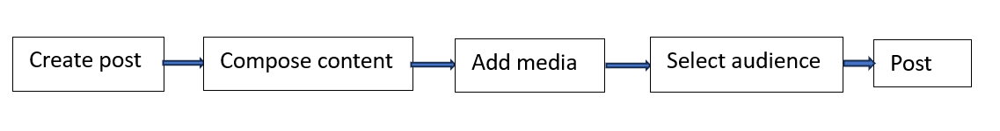

****Facebook****

**Create a post on Facebook**

Quick Start Guide

Version 1.0

- [Overview](#overview)
- [Prerequisites](#prerequisites)
- [Create a post](#create-a-post)
  - [Create post using mobile application](#create-post-using-mobile-application)
    - [Post a text message](#post-a-text-message)
    - [Change the background of a text message](#change-the-background-of-a-text-message)
    - [Share an image](#share-an-image)
    - [Share a video](#share-a-video)
    - [Share Photo/videos using Camera](#share-photovideos-using-camera)
    - [Share Feeling/activity](#share-feelingactivity)
    - [Share Check in](#share-check-in)
    - [Share GIF](#share-gif)
    - [Share Life event](#share-life-event)
    - [Share Music](#share-music)
    - [Share Live video](#share-live-video)
    - [Tag friends in a post](#tag-friends-in-a-post)
  - [Post using web browser](#post-using-web-browser)
    - [Post a text message](#post-a-text-message-1)
    - [Change the background of a text message](#change-the-background-of-a-text-message-1)
    - [Share an image](#share-an-image-1)
    - [Share an video](#share-an-video)
    - [Share Feeling/activity](#share-feelingactivity-1)
    - [Share Check in](#share-check-in-1)
    - [Share GIF](#share-gif-1)
    - [Share Life event](#share-life-event-1)
    - [Share Live video](#share-live-video-1)
    - [Tag friends in a post](#tag-friends-in-a-post-1)
- [Frequently Asked Questions](#frequently-asked-questions)
- [Troubleshooting](#troubleshooting)
- [Best Practices](#best-practices)

# Overview
Facebook launched in February 2004 as a school-based social network at Harvard University.Mark Zuckerberg and Eduardo Saverin, both students at the time, created the platform.

**Flow to create a post**

**Purpose of this guide**  
                                   This guide explains how to create a post on Facebook and how to attach different media options for your post.

# Prerequisites
* A phone with Facebook application or computer with a web browser  installed.
* A registered email address or phone number and password.

# Create a post  
Creating a post lets you share updates, media, and activities with friends, groups, or followers. You can create posts using the mobile app or a web browser.You can also promote events, links, or business content.

**Before you post, choose your audience**.
1. Log in to your Facebook account.
2. After you log in, home page appears. You see posts from friends, family, and the pages you follow.
3. Locate **What’s on your mind?**, then select **Create Post**.
   * On **Create Post** screen,select the audience selector drop-down below your name.
     * __Friends:__ Share your post with all your friends.
     * __Friends except:__ Exclude specific people.
     * __Specific friends:__ Share only with chosen people.
     * __Close friends:__ Create a custom audience by including or excluding specific groups or individuals.

## Create post using mobile application
Create your own post by logging in to mobile application and follow below steps.

### Post a text message
You can share text as your post.
1. Choose one of the following:
   * On your home screen, select **What’s on your mind?** at the top pane.
   * Open the **Menu** (three-line icon), select your profile picture, scroll down, and select **What’s on your mind?**.
    * From your profile page, scroll down and select **What’s on your mind?**.
2. Type your text.
3. Select **Post**.   
   Your post now appears on your home screen.

### Change the background of a text message   
You can set background colours for your text message (optional).
1. On home screen, select **What’s on your mind?**, then choose **Background colour**.
2. Choose a background colour.Select six dots on right pane to see more colours.
3. Select **Next**, then **POST**.   
   Your text post is now shared with a background color.

### Share an image 
You can attach photos to your post.
1. On home screen, select  **What’s on your mind?**, then choose **Photo/video.**
2. Browse and upload image from your device gallery.
3. Select **Next**.
4. To add more images, select **Add More** on below pane.
5. (Optional) Enter text in **Say something about this photo..** .
6. Select **POST**.   
   Your image post is now shared.

### Share a video 
You can attach videos to your post.
1. On home screen, select  **What’s on your mind?**, then choose **Photo/video.**
1. Select and upload a video from your device gallery.
3. Select **Next**.
4. To add more videos, select **Add More** on below pane.
5. (Optional) Enter text in **Say something about this photo..**
6. Select **POST**.   
   Your video post is now shared.

### Share Photo/videos using Camera   
You can attach photos and videos to your post by instant capture.
1. On home screen, select **What’s on your mind?**, then choose **Camera.**
2. Allow camera access.
3. Capture a photo or video, then select **DONE**.
4. To add more photos or video, select **Add More** on below pane.
5. (Optional) Enter text in **Say something about this photo..**           (optional).
6. Select **POST**.   
   Your captured Photo or video is now shared.

### Share Feeling/activity
You express how you are feeling or what you are doing by selecting on emojis and activity images.
1. On home screen, select **What’s on your mind?** ,then choose **Feeling/activity**.          
2.  Select an emojis.
3.  Go to the **ACTIVITIES** tab and select an activity or search for one from the list.
4. Select **POST**.   
   Your feeling or activity is now shared.

### Share Check in
You post your location. Useful for businesses or when you are sharing photos of places you have visited.
1. On home screen, select **What’s on your mind?** ,then choose **Check in**.  
2. Search for a location or select one from the list.
3. Select **POST**.   
   Your location is now shared.

### Share GIF
You post GIF images.
1. On home screen, select **What’s on your mind?**, then choose **GIF**.  
2. Search for a GIF or select one from the list.
3. (Optional) Enter text in **Say something about this photo**.   
4. Select **POST**.  
   Your GIF is now shared. 

### Share Life event   
Share and remember important moments from your life.     
1. On home screen, select **What’s on your mind?**, then choose **Life event**.  
1. Select a category.
2. Enter the title and complete the fields on the screen.
3. (Optional)Add Photos/**Videos**.
4. Select **NEXT**, then **POST**.   
   Your life event is now shared.

### Share Music
You can share music.
1. On home screen, select **What’s on your mind?**, then choose **Music**. 
2. Search for a song or select one from the list.
4. Select **Done**, then **POST**.   
   Your music is now shared.

### Share Live video   
You can share Live video.

1. Choose one of the following:
    * On home screen, select **What’s on your mind?**, then choose **Live video**.
    * Open the menu (top right), select your profile, scroll down, and select **Live**.
    * From your profile (left pane), scroll down and select **Live**.  
1. Allow camera and microphone access.
2. Add details.
   * Write a description.
   * Choose your audience.
   * (Optional) Tag people, add a location, or select a feeling/activity.
3. Select **Go Live** to start broadcasting.
4. When finished select **Finish**, then **Done**.   
   Your live video is now posted on your home screen.   

### Tag friends in a post 
Tag friends in your text posts, photos, videos, life events, activities, or check-ins. When you tag someone, they receive a notification. Tagging also adds context to the post by involving people.

1. On home screen, select **What’s on your mind?**. 
2. Type your text and attach media(optional).
3. Select **Tag people**.
4. Choose from the suggested people or search for people.
5. Select **POST**.
   Your post is now shared with tagged audience.

## Post using web browser
Create your own post by logging in to web browser and follow below steps.

### Post a text message  
You can share text as your post.

1. Choose one of the following:
   * On your home page, select **What’s on your mind?** at the top pane.
   * Select your profile picture on the top-right pane, choose your name, scroll down, and select **What’s on your mind?**.
   * Select your profile picture on the top-left pane and locate **What’s on your mind?**.
1. Type your text.
2. Select **Post**.
   Your text post now appears on your home page.

### Change the background of a text message 
You can set background colours for your text message(optional).
1. On your home page, select **What’s on your mind?**, then select the small square (Aa) on the left pane.
2. Choose a background color. Select the four dots on the right pane to see more colors.
3. Select **POST**.   
   Your text post is now shared with a background color.

### Share an image
You can attach photos to your post.          
1. Choose one of the following:
    * On home page, select **What’s on your mind?**, then select **Photo/video**.
    * Open the menu (top right), select your profile, scroll down, and select **Photo/video**.
    * From your profile (left pane), scroll down and select **Photo/video**. .
2. Upload an image from your device.
3. Select **Next**.
4. (Optional) Select **Add More** to upload more images.
5. (Optional) Enter text in **Say something about this photo..**.
6. Select Post.
   Your image is now shared.

### Share an video
You can attach video to your post.

1. Choose one of the following:
    * On home page, select **What’s on your mind?**, then select **Photo/video**.
    * Open the menu (top right), select your profile, scroll down, and select **Photo/video**.
    * From your profile (left pane), scroll down and select **Photo/video**. 
1. Upload a video from your device.
2. Select **Next**.
3. To add more videos, select **Add More**.
4. (Optional) Enter text in **Say something about this video…**.
5. Select Post.
   Your video is now shared.

### Share Feeling/activity  
You express how you are feeling or what you are doing by selecting on emojis and activity images.

1. Choose one of the following:
    * On home page, select **What’s on your mind?**, then select **Feeling/activity**.
    * Open the menu (top right), select your profile, scroll down, and select **Feeling/activity**.
    * From your profile (left pane), scroll down and select **Feeling/activity**. 
2. Select an emoji.
3. Go to the **Activities** tab and select an activity or search one from list.
4. Select Post.
   Your feeling or activity is now shared.

### Share Check in
You post your location. Useful for businesses or when you are sharing photos of places you have visited.
1. On your home page, select **What’s on your mind?**, then select **Check in**.  
2. Search for a location or select one from the list.
3. Select **POST**.   
   Your location is now shared.

### Share GIF
You post GIF images.
1. On your home page, select **What’s on your mind?**, then select **GIF**.  
2. Search for a GIF or select one from the list.
3. (Optional) Enter text in **What’s on your mind?**.
4. Select **POST**.  
   Your GIF image is now shared. 

### Share Life event
Share and remember important moments from your life.     
1. On your home page, select **What’s on your mind?**.
2. Select the three dots on right pane and select **Life event**.  
3. Select a category.
4. Enter the title and complete the fields on the screen.
5. (Optional) Add **Photos/Videos**.
6. Select **DONE**, then **POST**.   
   Your life event is now shared.

### Share Live video  
You can share Live video.
1. Choose one of the following:
    * On home page, select **What’s on your mind?**, then select **Live video**.
    * Open the menu (top right), select your profile, scroll down, and select **Live**.
    * From your profile (left pane), scroll down and select **Live**.
2. Select a video source as **Webcam** or **Streaming software** (OBS, Streamlabs)
3. On left pane,select **Go Live**.
4. Enter a title in **Add title**.
5. Check your camera/microphone preview.
6. Select **Go Live** to start streaming.
7. When finished, select **End Live Video**.  
   Your recording is saved and shared on your home page.

### Tag friends in a post
Tag friends in your text posts, photos, videos, life events, activities, or check-ins. When you tag someone, they receive a notification. Tagging also adds context to the post by involving people.

1. On your home page, select **What’s on your mind?**. 
2. Type your text, choose your media files to attach or upload.
3. Select **Tag people**.
4. Choose from the list or search for people.
5. Select **POST**.  
   Your post is now shared with tagged audience.

# Frequently Asked Questions
**Can I edit or delete a post after publishing?**      
* **Edit:** Select the three dots (…) on your post, then choose Edit post.
* **Delete:** Select the three dots (…) and Move to trash. 

**How do I check post-performance?**
* **On personal profiles:** You can only see likes, shares, and comments.
* **On Pages:** Use Facebook insights to view reach, engagement, and audience statistics.

# Troubleshooting

**Issue 1:** My post is not publishing.
* Check your internet connection.
* Refresh the page or app.
* Try posting from another device or browser.

**Issue 2:** The app crashes when I try to post.
* Update the application from google play(or App Store)
* Reinstall the app.
* Restart your device.
  
# Best Practices
* Use 1-3 relevant hashtags.
* Keep your color scheme clean and consistent.
* Use simple and direct language.
* Limit posts for about 1-3 short sentences.

